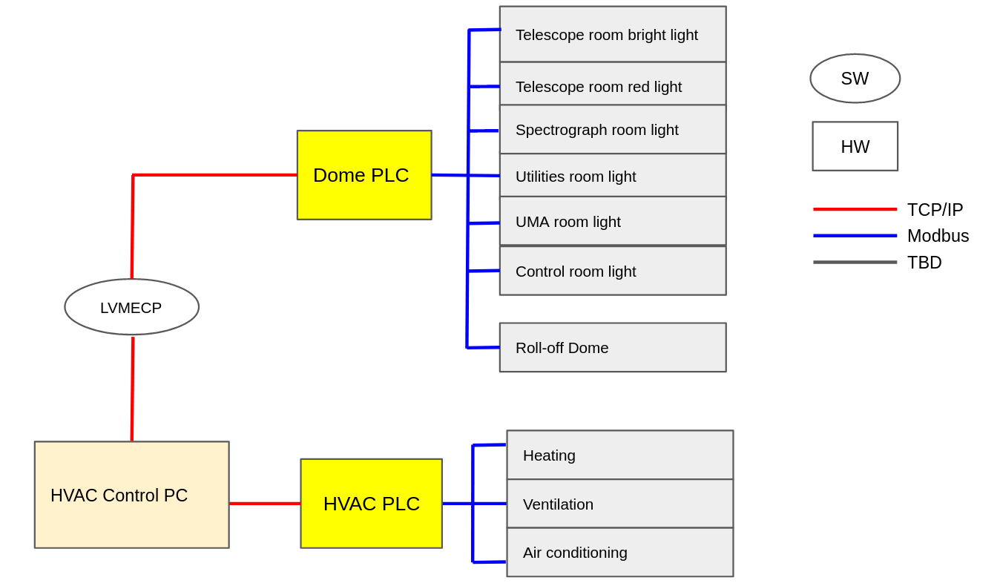
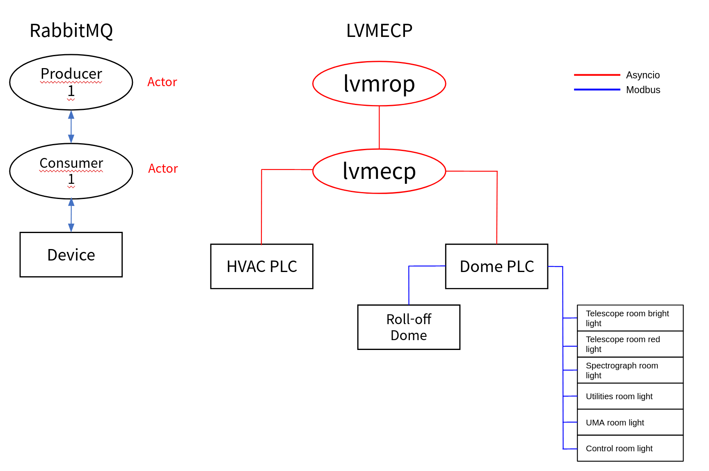

.. _Introduction:

Introduction
====================

The LVM-I Enclosure is the building that hosts the LVM-I, including all its sub-systems. The LVM-I Enclosure Control System (LVMECP) is low-level software of the LVM-I Robotic Observation Package and is implemented in Python using SDSS software framework that provides the coding standards and python template. The LVMECP will control two PLC systems: Dome PLC and HVAC PLC. The Dome PLC control the components connected with it, which are a roll-off dome and enclosure lights. The HVAC PLC also control HVAC system in the spectrograph room and the Purge Air system.

Hardware components
-------------------------

Here is the Hardware and Software Component diagram in enclosure.

Architecture
--------------------------

Here is the Architecture and component diagram explaining the hierarchy of lvmecp.
lvmecp is using the AMQP Actor class from clu which is based on RabbitMQ protocol, and each actor becomes a producer/consumer to activate commands.

