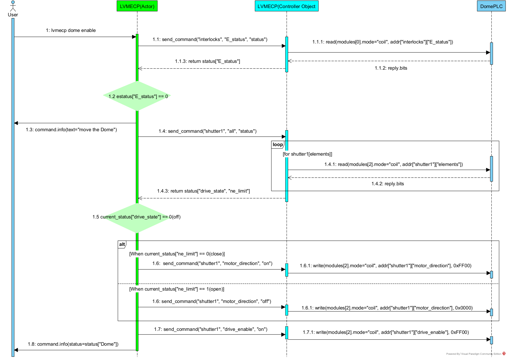
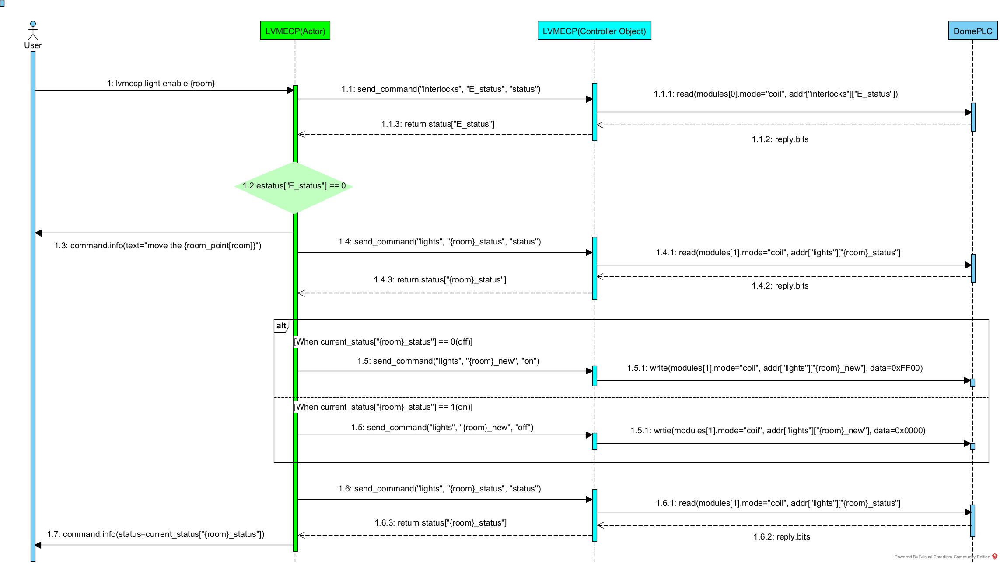
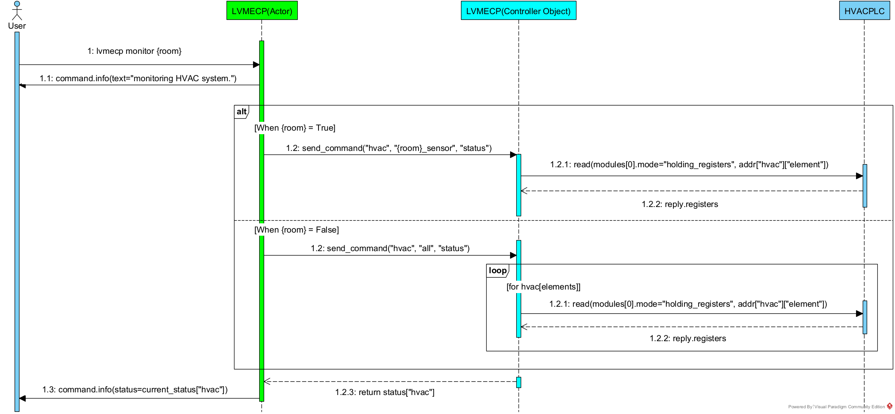

.. _Sequence:

Sequence diagram
====================

Here are `sequence diagrams<https://en.wikipedia.org/wiki/Sequence_diagram>` of each command.
LVMECP communicates with three objects which are Actor, Controller and PLC. The sequence diagrams 
illustrate message sequences between objects. We can visualize the logic of internal process for 
performance over time after enacting specific command.

Dome
-------------------------

dome status

.. image:: _static/SequenceDiagram_domestatus.png
    :align: center

dome enable

Light
---------------------------

light status

light enable

Monitor
---------------

Telemetry
------------------

Estop
-----------------

.. image:: _static/SequenceDiagram_estop.png
    :align: center

